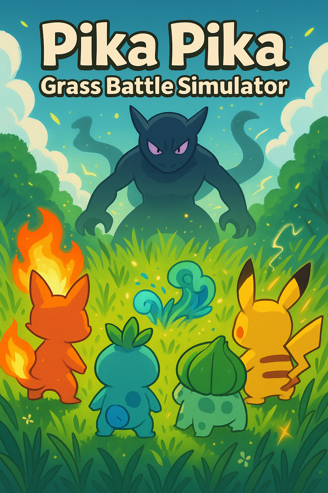

# 🌿 Grass Battle Simulator

**Grass Battle Simulator** is a text-based Python adventure game inspired by classic creature-battling gameplay. As a trainer, you choose one of four elemental companions—Fire, Water, Grass, or Electric—and explore a dynamic grid-based map filled with wild monsters, potions, and a hidden final boss. Your journey is driven by turn-based decisions, strategic encounters, and level-based growth.

---

## 🎮 Features

- 🧭 Grid-based exploration with live player position tracking
- 🐾 Wild monsters randomly placed in the tall grass
- ✂️ Rock-paper-scissors battle mini-game for wild monster encounters
- 💖 Potions restore +20 HP; losing to monsters causes -20 HP
- 📈 Level up each time you win a battle (max level 5)
- 👑 Boss appears on the map and can only be defeated at level 5
- 🏃 Players may choose to fight or flee from the Boss (fleeing is wise before level 5!)
- 🔁 Every defeated monster is replaced by a new one to maintain challenge
- 🔚 Game ends when player defeats the Boss or HP drops to 0

---

## 🧭 How to Play

1. Clone or download this repository.
2. Navigate to the project directory in terminal.
3. Launch the game:

```bash
python3 main.py
```

4. Choose your Pokémon-style partner (Fire, Water, Grass, or Electric).
5. Move using `W`, `A`, `S`, `D` keys.
6. Explore the map:
   - Encounter monsters? Fight using rock-paper-scissors.
   - Win to level up, lose to take damage.
   - Found a potion? Restore health.
7. Reach level 5 and confront the Boss — win the game!

---

## 🗂 File Structure

```
GrassBattleSimulator/
├── main.py       # Main game loop and player interaction
├── map.py        # Map creation and display logic
├── player.py     # Player class with movement and stats
├── battle.py     # Rock-paper-scissors combat mini-game
├── wildmon.py    # Wild monster and boss class logic
├── cover.png     # Game cover illustration (optional)
├── README.md     # Game instructions and project info
├── .gitignore    # Ignores cache, system files like .DS_Store
```

---

## 🧠 Developer Notes

- All monsters are replaced when defeated to keep gameplay fresh.
- Boss behavior is conditional: if you're underleveled, you may flee or suffer a powerful attack.
- The player must manage health, risk, and reward while navigating the map.
- All gameplay happens through terminal prompts and decisions.

---

## 📜 License

This game is open for COMP9001 use only.

---

✨ *Train. Explore. Battle. Become the Grassland Champion.*
